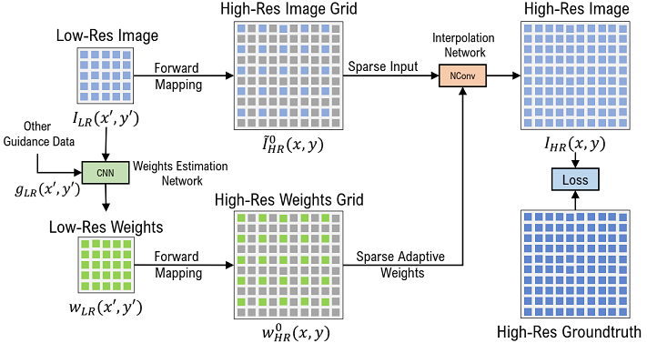

# Normalized Convolution Upsampler (NCUP)

This is the official PyTorch implementation for our paper:

**Normalized Convolution Upsampling for Refined Optical Flow Estimation**

Abdelrahman Eldesokey, and Michael Felsberg 

Published at **VISAPP 2021**, Online Conference

\[ [ArXiv]() ]  

```

```





## Requirements

The code has been tested with PyTorch 1.6 and Cuda 10.1.
```Shell
conda create --name raft
conda activate raft
conda install pytorch=1.6.0 torchvision=0.7.0 cudatoolkit=10.1 -c pytorch
conda install matplotlib
conda install tensorboard
conda install scipy
conda install opencv
```


## Pretrained Models

Pretrained models can be downloaded from [Google Drive](https://drive.google.com/drive/folders/1ba-_Ao_XxXOg_Y2gH3KEy3MI_nz70RN3) and should be placed in `models` directory.


## Datasets

To evaluate/train RAFT, you will need to download the required datasets. 
* [FlyingChairs](https://lmb.informatik.uni-freiburg.de/resources/datasets/FlyingChairs.en.html#flyingchairs)
* [FlyingThings3D](https://lmb.informatik.uni-freiburg.de/resources/datasets/SceneFlowDatasets.en.html)
* [Sintel](http://sintel.is.tue.mpg.de/)
* [KITTI](http://www.cvlibs.net/datasets/kitti/eval_scene_flow.php?benchmark=flow)


By default `datasets.py` will search for the datasets in these locations. You can create symbolic links to wherever the datasets were downloaded in the `datasets` folder

```Shell
├── datasets
    ├── Sintel
        ├── test
        ├── training
    ├── KITTI
        ├── testing
        ├── training
        ├── devkit
    ├── FlyingChairs_release
        ├── data
    ├── FlyingThings3D
        ├── frames_cleanpass
        ├── frames_finalpass
        ├── optical_flow
```


## Evaluation

You can evaluate a trained model by running any of the bash scripts `eval_raft_nc_sintel.sh` and `eval_raft_nc_kitti.sh`
```Shell
./eval_raft_nc_sintel.sh
```


## Training

We used the following training schedule in our paper (2 GPUs). Training logs will be written to the `runs` which can be visualized using tensorboard.

Available training scripts are `train_raft_nc_sintel.sh`,`train_raft_nc_kitti.sh`, and `train_raft_nc_things.sh`

```Shell
./train_raft_nc_sintel.sh
```


## Acknowledgements

> The code has been borrowed and modified from the official code for [RAFT: Recurrent All Pairs Field Transforms for Optical Flow](https://github.com/princeton-vl/RAFT)
